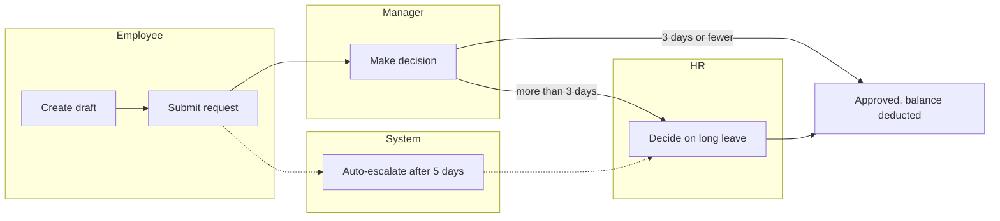
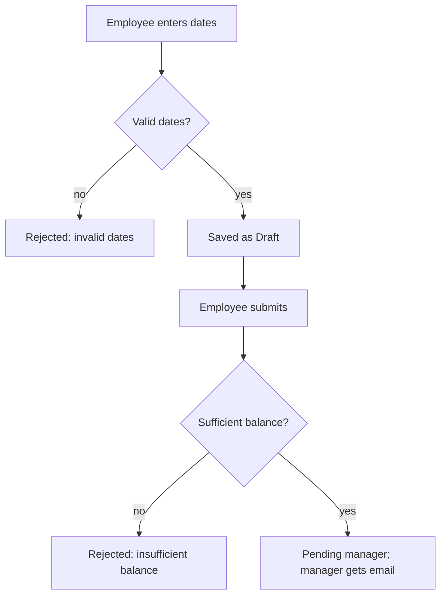
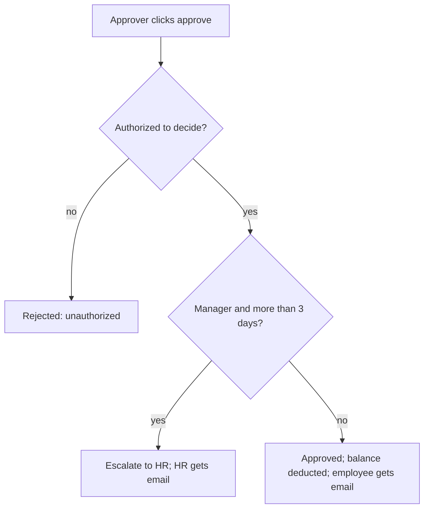
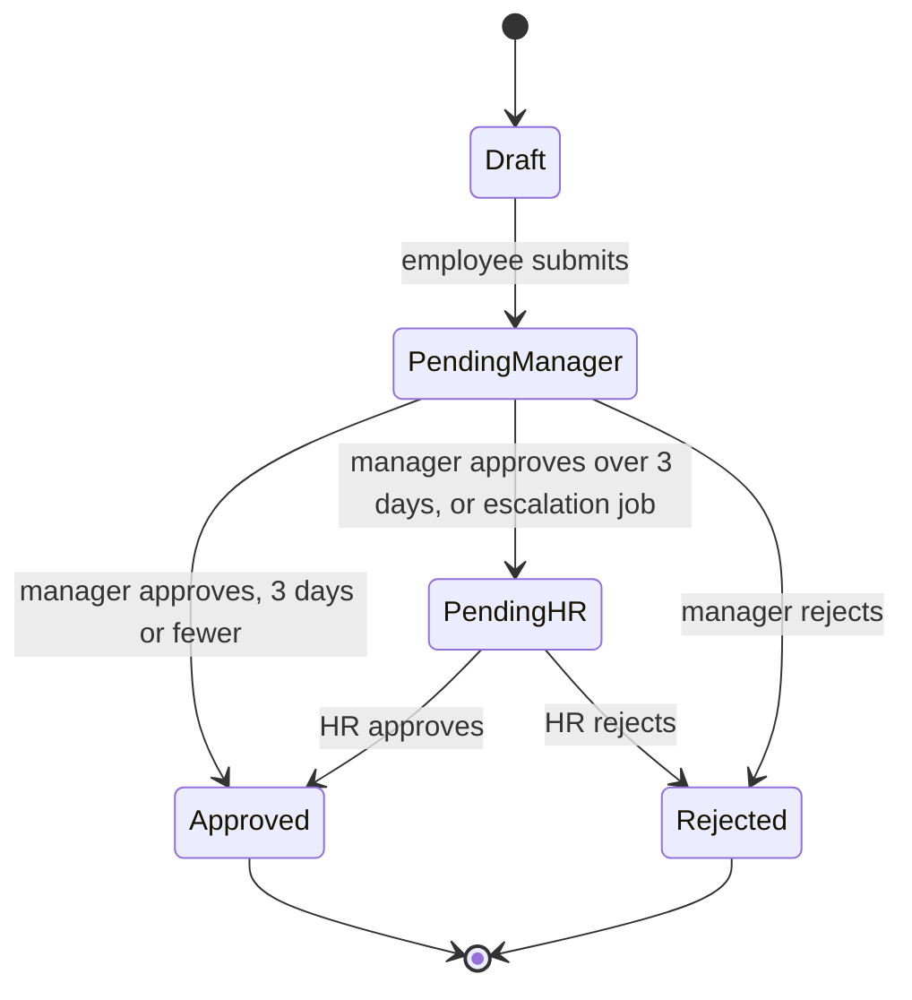
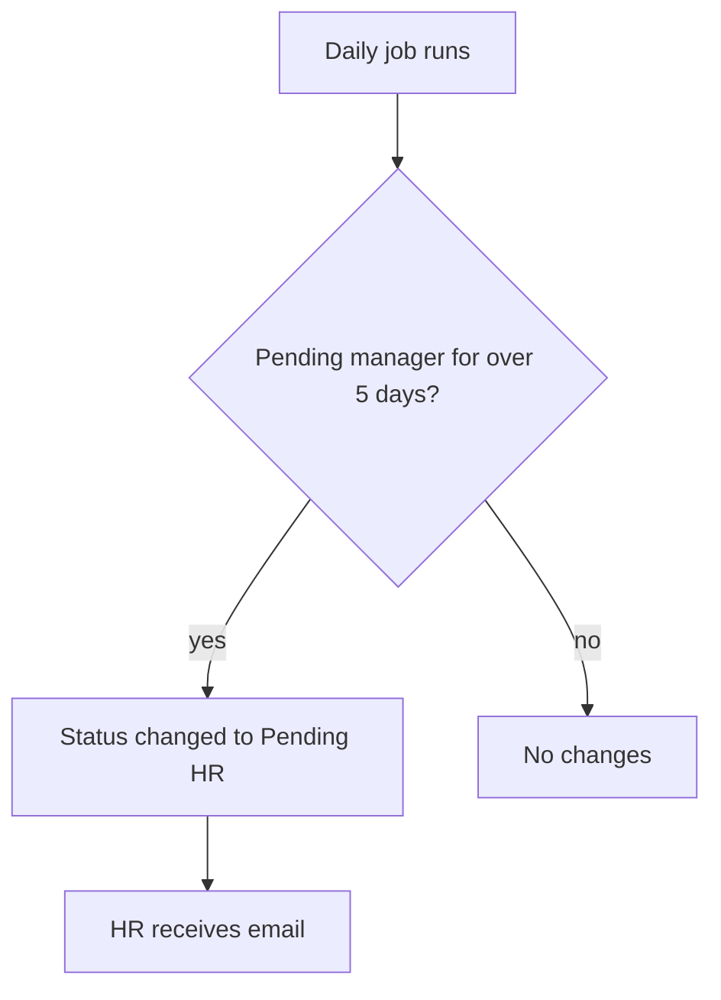

# Leave Request Application: business flow

## Summary

**Purpose.** Employees submit leave requests, managers or HR make approval decisions, and annual leave allowance is deducted once leave is approved.

**Actors.** Employee (creates and submits requests); Direct Manager (approves or rejects); HR (decides on long leave and requests unhandled by managers); System (daily job that escalates stagnant requests).

### The journey in one picture

### Flows at a glance

| Flow | Actor | In one line |
|---|---|---|
| Submit leave request | Employee | Draft is created and submitted if dates are valid and balance is sufficient |
| Decide on leave request | Manager, HR | Approve or reject; leave longer than 3 days must go through HR |
| Automatic escalation | System | Requests untouched by manager for more than 5 days are escalated to HR |

**Biggest open questions.** Does the remaining balance intentionally ignore pending requests? Are weekends and holidays intentionally counted as leave days?

## Flows

### Submit leave request

**Trigger.** Employee creates a draft and clicks submit. **Actor.** Employee. **Outcome.** Request status is "Pending manager approval" and manager receives an email notification.

**Steps.**

1. Employee enters start and end dates; system rejects if end date is earlier than start date. [FACT] `app.py:14-15`
2. Request is saved as Draft. [FACT] `app.py:16-17`
3. Employee submits; system checks ownership, Draft status, and balance. [FACT] `app.py:25-28`
4. Status transitions to pending manager, submission time is recorded, manager receives email. [FACT] `app.py:29-32`

**Business rules.**

| ID | Rule | Tag | Evidence |
|---|---|---|---|
| BR-01 | End date cannot be earlier than start date. | [FACT] | `app.py:14-15` |
| BR-02 | Total days are calculated using calendar days, including weekends and public holidays, from start to end date. | [FACT] | `models.py:30-31` |
| BR-03 | Only the request owner can submit, and only from Draft status. | [FACT] | `app.py:25-26` |
| BR-04 | Submission is rejected if requested days exceed remaining balance. | [FACT] | `app.py:27-28` |
| BR-05 | Annual allowance is 12 days; remaining balance equals allowance minus approved leaves starting in the current year. | [FACT] | `models.py:17`, `app.py:66-68` |
| BR-06 | Pending requests do not reduce remaining balance, and balance is not re-checked upon approval. Is this intentional? | [UNKNOWN] | `app.py:67` |

**Failure and exceptions.** Invalid dates and insufficient balance halt the process with an error response. Duplicate submission is prevented because only Draft requests can be submitted.

### Decide on leave request

**Trigger.** Manager or HR clicks approve or reject. **Actor.** Direct Manager, HR. **Outcome.** Request is Approved, Rejected, or escalated to HR.

**Steps.**

1. System verifies who is authorized to decide at current status. [FACT] `policies.py:6-14`
2. If approved by manager and leave is longer than 3 days, status becomes "Pending HR approval" and HR receives email. [FACT] `app.py:42-44`
3. Otherwise, status becomes Approved, approval timestamp is recorded, balance is deducted, and employee receives email. [FACT] `app.py:45-49`
4. If rejected, status becomes Rejected and employee receives email containing reason (optional). [FACT] `app.py:60-62`

**Lifecycle of leave request.** UI labels: Draft, Pending manager approval, Pending HR approval, Approved, Rejected. [FACT] `models.py:9-15`

**Business rules.**

| ID | Rule | Tag | Evidence |
|---|---|---|---|
| BR-07 | No one may approve or reject their own leave request. | [FACT] | `policies.py:8-9` |
| BR-08 | Under pending manager status, only the employee's direct manager may decide. | [FACT] | `policies.py:10-11` |
| BR-09 | Under pending HR status, only users with HR role may decide. | [FACT] | `policies.py:12-13` |
| BR-10 | Leave exceeding 3 days is not final upon manager approval; HR approval is mandatory. | [FACT] | `policies.py:3`, `policies.py:17-18`, `app.py:42-44` |
| BR-11 | Final approval records approval date and calls balance deduction. | [FACT] | `app.py:45-48` |
| BR-12 | The balance deduction function implementation is absent from inspected code, even though remaining balance is calculated dynamically from Approved requests. Is balance stored redundantly, risking double deduction? | [UNKNOWN] | `app.py:48` |
| BR-13 | Rejection reason is optional. | [FACT] | `app.py:62` |

**Failure and exceptions.** Unauthorized decision-makers receive access denial. There are no rules in code for cancelling an already approved request.

### Automatic escalation of stagnant requests

**Trigger.** Scheduled job. **Actor.** System. **Outcome.** Requests pending manager approval for too long are escalated to HR.

**Steps.**

1. Job finds requests in pending manager status submitted more than 5 days ago. [FACT] `jobs.py:12-13`
2. Each matching request is updated to pending HR status and HR receives an email. [FACT] `jobs.py:14-15`

**Business rules.**

| ID | Rule | Tag | Evidence |
|---|---|---|---|
| BR-14 | Escalation threshold is 5 calendar days since submission timestamp. | [FACT] | `jobs.py:6`, `jobs.py:12-13` |
| BR-15 | Job runs daily. | [INFERRED] | Inferred solely from docstring in `jobs.py:11`; schedule configuration was not found in examined code |
| BR-16 | Does the manager receive a reminder before escalation, and is the employee notified upon escalation? | [UNKNOWN] | `jobs.py:15` |

**Failure and exceptions.** The job sends an email only to HR; neither manager nor employee is notified by this code path.

## Technical detail

### Coverage

Inspected: `app.py`, `models.py`, `policies.py`, `jobs.py`, `notifications.py`, `templates/leave_list.html`. Not found in repository: Celery schedule configuration, database migrations, automated tests, and definitions for `login_required`, `hr_inbox`, `deduct_balance`. The `.env` file was deliberately excluded from analysis.

### Entities

| Entity | Business meaning | Key states or fields | Evidence |
|---|---|---|---|
| Leave request | A single leave request submitted by an employee | status, submitted_at, approved_at | `models.py:20` |

### Integrations and automatic work

| What | Trigger | Effect | Evidence |
|---|---|---|---|
| SMTP Email | Submit, approve, reject, escalate | Notifies manager, HR, or employee | `notifications.py:4-6` |
| Escalation job | Scheduled (schedule not found in code) | Escalates stagnant requests to HR | `jobs.py:9-10` |

### Open questions

1. Should pending leave requests reserve allowance from the remaining balance? [UNKNOWN]
2. Should weekends and public holidays be excluded from leave day count? [UNKNOWN]
3. Where is balance actually deducted, and is there double-deduction risk? [UNKNOWN]
4. Who should be notified when the escalation job moves a request? [UNKNOWN]
