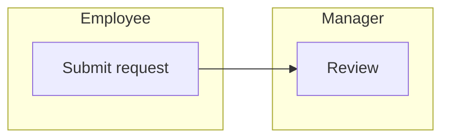
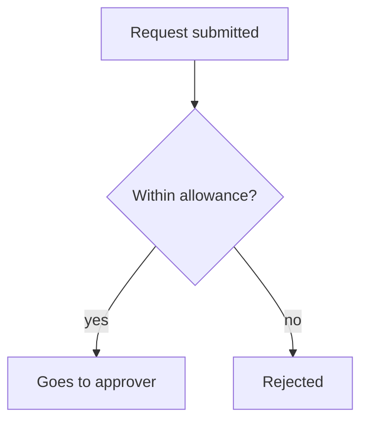
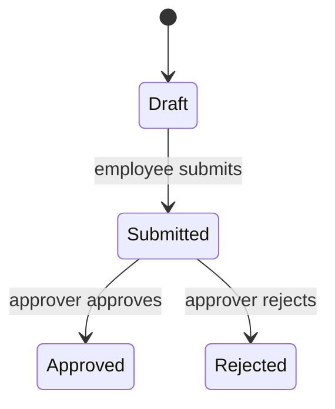

# {{App name}}: business flow

<!-- Translate headings and prose into the user's language. Keep the order and the heading levels: each level-2 heading becomes a tab in the HTML. Delete all HTML comments and every {{placeholder}} before validating. -->

## Summary

<!-- Layer 1. A reader should get the whole picture here in two minutes. No code identifiers. -->

**Purpose.** {{One or two sentences: who uses the app, what outcome it gives them.}}

**Actors.** {{Role}} ({{what they do}}); {{Role}} ({{what they do}}); System ({{scheduled or automatic work, if any}}).

### The journey in one picture

### Flows at a glance

| Flow | Actor | In one line |
|---|---|---|
| {{Flow name}} | {{Actor}} | {{What it achieves and what ends it}} |

**Biggest open questions.** {{Two or three UNKNOWN items, as questions for the business owner.}}

## Flows

<!-- Layer 2. One level-3 heading per flow, each with at least one mermaid block. -->

### {{Flow name}}

**Trigger.** {{What starts it: user action, schedule, webhook.}} **Actor.** {{Who.}} **Outcome.** {{What is true when it ends.}}

**Steps.**

1. {{Step in business words.}} [FACT] `path/to/file.ext:12`
2. {{Next step.}} [INFERRED] {{what this rests on}}

**Lifecycle of {{entity}}.**

**Business rules.**

| ID | Rule | Tag | Evidence |
|---|---|---|---|
| BR-01 | {{Rule stated as a plain sentence.}} | [FACT] | `path/to/file.ext:30-34` |
| BR-02 | {{Rule suggested but not enforced in code read.}} | [INFERRED] | {{basis}} |
| BR-03 | {{Question that code cannot answer?}} | [UNKNOWN] | none |

**Failure and exceptions.** {{What happens on rejection, timeout, duplicate, missing data.}}

## Technical detail

<!-- Layer 3. For developers and for checking the report. -->

### Coverage

{{What you read, what you skipped, assumptions about scope. A stated gap is fine.}}

### Entities

| Entity | Business meaning | Key states or fields | Evidence |
|---|---|---|---|
| {{Entity}} | {{Meaning}} | {{States}} | `path/to/model.ext:1` |

### Integrations and automatic work

| What | Trigger | Effect | Evidence |
|---|---|---|---|
| {{Email, payment, job}} | {{When}} | {{What changes}} | `path/to/file.ext:1` |

### Open questions

1. {{Question for the business owner.}} [UNKNOWN]
